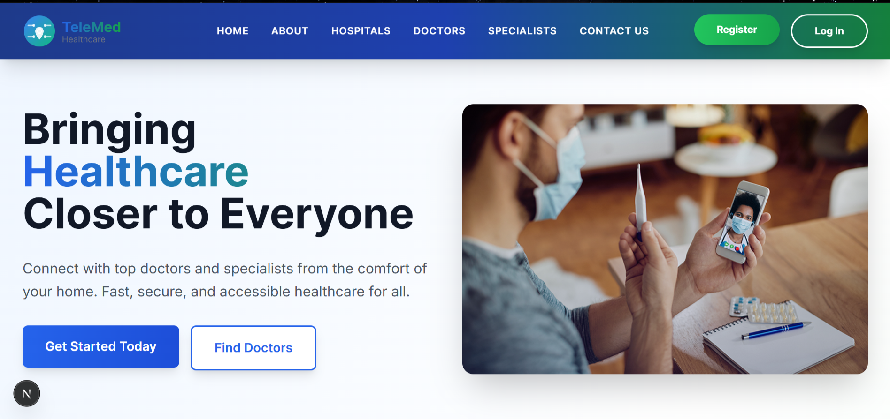

# MediCare - Modern Telemedicine Platform

## Introduction
MediCare is a comprehensive telemedicine platform designed to connect patients with healthcare providers across East Africa. Built with modern technologies, it provides a seamless experience for virtual healthcare consultations, appointment scheduling, and health record management.


### Homepage


## 🏗️ Architecture

### Frontend (Next.js 15 + TypeScript)
- **Framework**: Next.js 15 with App Router
- **Styling**: Tailwind CSS for modern, responsive design
- **Language**: TypeScript for type safety
- **Components**: Modular React components with reusable UI elements

### Backend (Node.js + TypeScript)
- **Runtime**: Node.js with TypeScript
- **Database**: SQLite with proper schema
- **API**: RESTful endpoints for user management and healthcare services

## 🚀 Features

### Core Functionality
1. **User Authentication** - Secure login/registration for patients, doctors, and admins
2. **Patient Profile Management** - Complete health records and appointment history
3. **Doctor Profile Management** - Professional profiles with specialties and availability
4. **Appointment Scheduling** - Easy booking system with real-time availability
5. **Admin Dashboard** - Comprehensive management tools for healthcare providers
6. **Secure Data Storage** - HIPAA-compliant data protection

### Modern UI/UX
- **Responsive Design** - Works perfectly on all devices
- **Beautiful Interface** - Modern gradients and animations
- **Accessibility** - ARIA labels and keyboard navigation
- **Performance** - Optimized images and fast loading times

## 🛠️ Tech Stack

**Frontend:**
- Next.js 15
- TypeScript
- Tailwind CSS
- React Icons

**Backend:**
- Node.js
- TypeScript
- SQLite
- Express.js

**Development:**
- ESLint for code quality
- Prettier for formatting
- Git for version control

## 📱 User Experience

The platform provides a seamless experience for:
- **Patients**: Easy appointment booking, secure consultations, medical history access
- **Doctors**: Patient management, consultation tools, schedule management
- **Hospitals**: Network integration, patient referrals, resource management

## 🚀 Getting Started

### Prerequisites
- Node.js 18+
- npm or yarn

### Installation

1. **Clone the repository**
   ```bash
   git clone https://github.com/yourusername/MediCare.git
   cd MediCare
   ```

2. **Install Frontend Dependencies**
   ```bash
   cd frontend
   npm install
   ```

3. **Install Backend Dependencies**
   ```bash
   cd ../backend
   npm install
   ```

4. **Start Development Servers**
   ```bash
   # Frontend (from frontend directory)
   npm run dev
   
   # Backend (from backend directory)
   npm run dev
   ```

## 📄 License

This project is licensed under the MIT License - see the LICENSE file for details.

## 🤝 Contributing

Contributions are welcome! Please feel free to submit a Pull Request.
